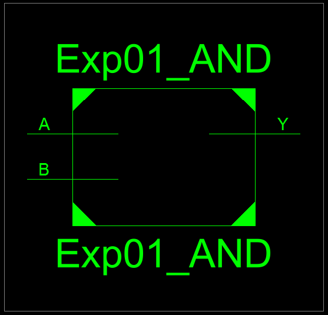
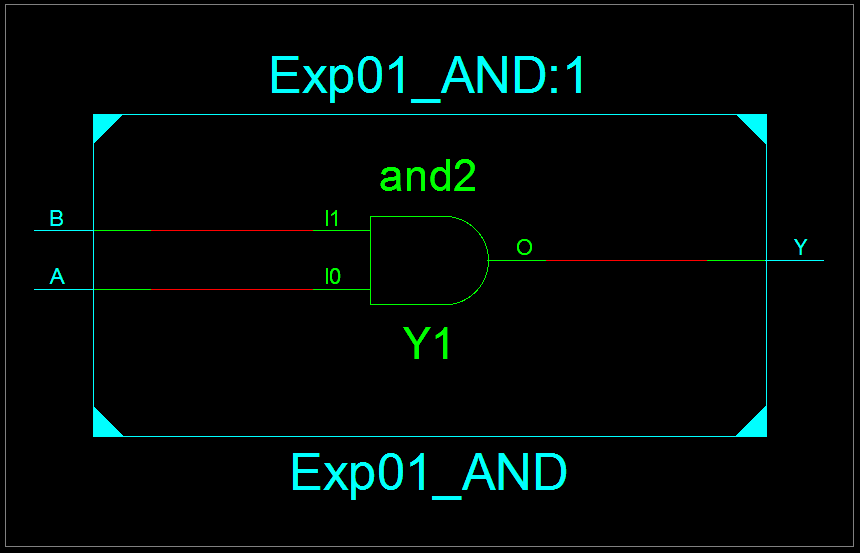
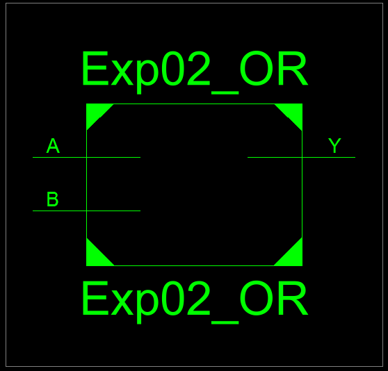
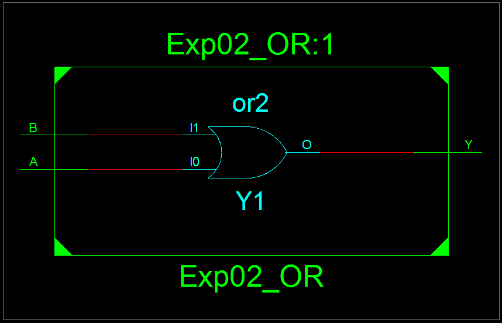
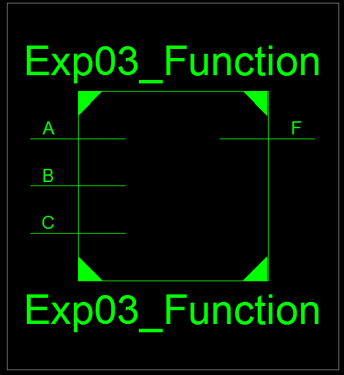
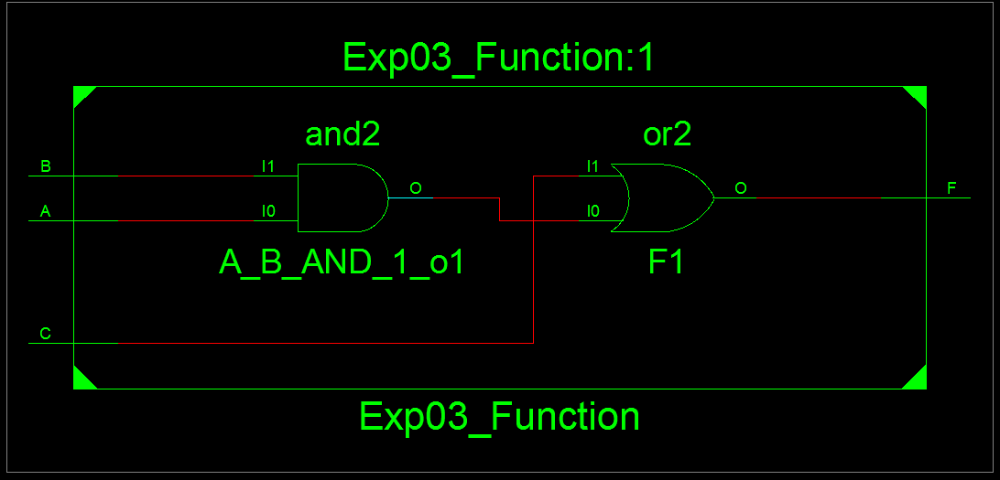
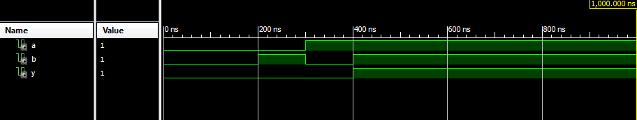
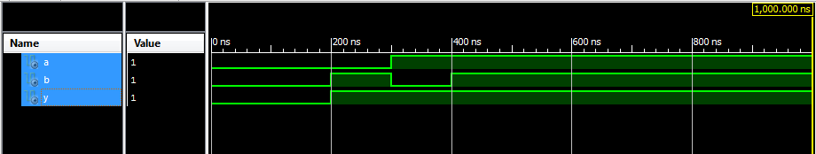
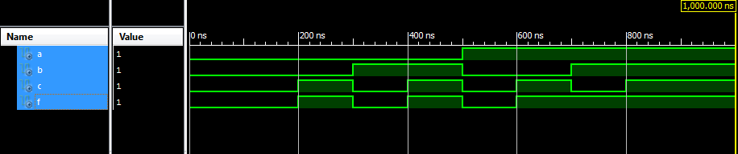

# Lab 01 - Introduction to VHDL

## Objective 

To design and simulate basic digital circuits using VHDL.

## Theory

The full form of VHDL is VHSIC Hardware Description Language. It is a standard powerful language 
for designing, simulating and syntheisizing digital electronic systems from simple logic gates 
to complex processors used for FPGA/ASIC development.

**Key Aspects:**
- Hardware modeling
- Simulation
- Concurrency
- Standardization
- Synthesis
- Components

---

## Source Code

### VHDL Code for AND Gate

```vhdl
----------------------------------------------------------------------------------
-- Module Name:    Exp01_AND - Behavioral 
----------------------------------------------------------------------------------
library IEEE;
use IEEE.STD_LOGIC_1164.ALL;

entity Exp01_AND is
    Port ( A : in  STD_LOGIC;
           B : in  STD_LOGIC;
           Y : out  STD_LOGIC);
end Exp01_AND;

architecture Behavioral of Exp01_AND is

begin
	Y <= A and B;

end Behavioral;
```

**Output:**



*Figure 1: RTL Schematic Block of AND Gate*



*Figure 2: RTL Schematic Diagram of AND Gate*


### VHDL Code for OR Gate

```vhdl
----------------------------------------------------------------------------------
-- Module Name:    Exp02_OR - Behavioral 
----------------------------------------------------------------------------------
library IEEE;
use IEEE.STD_LOGIC_1164.ALL;

entity Exp02_OR is
    Port ( A : in  STD_LOGIC;
           B : in  STD_LOGIC;
           Y : out  STD_LOGIC);
end Exp02_OR;

architecture Behavioral of Exp02_OR is

begin
	Y <= A or B;

end Behavioral;
```

**Output:**



*Figure 3: RTL Schematic Block of OR Gate*



*Figure 4: RTL Schematic Diagram of OR Gate*


### VHDL Code for OR F = AB +C

```vhdl
----------------------------------------------------------------------------------
-- Module Name:    Exp03_Function - Behavioral 
----------------------------------------------------------------------------------
library IEEE;
use IEEE.STD_LOGIC_1164.ALL;

entity Exp03_Function is
    Port ( A : in  STD_LOGIC;
           B : in  STD_LOGIC;
           C : in  STD_LOGIC;
           F : out  STD_LOGIC);
end Exp03_Function;

architecture Behavioral of Exp03_Function is

begin
	F <= (A and B) or C;

end Behavioral;
```

**Output:**



*Figure 5: RTL Schematic Block of F = AB + C*



*Figure 6: RTL Schematic Diagram of F = AB + C*

### Test Bench Code for AND Gate

```vhdl
--------------------------------------------------------------------------------
-- VHDL Test Bench Created by ISE for module: Exp01_AND
--------------------------------------------------------------------------------
LIBRARY ieee;
USE ieee.std_logic_1164.ALL;
 
ENTITY Exp04_ANDTestBench IS
END Exp04_ANDTestBench;
 
ARCHITECTURE behavior OF Exp04_ANDTestBench IS 
 
    -- Component Declaration for the Unit Under Test (UUT)
    
    COMPONENT Exp01_AND
    PORT(
         A : IN  std_logic;
         B : IN  std_logic;
         Y : OUT  std_logic
        );
    END COMPONENT;
    
   --Inputs
   signal A : std_logic := '0';
   signal B : std_logic := '0';

 	--Outputs
   signal Y : std_logic;
 
BEGIN
 
	-- Instantiate the Unit Under Test (UUT)
   uut: Exp01_AND PORT MAP (
          A => A,
          B => B,
          Y => Y
        );
 

   -- Stimulus process
   stim_proc: process
   begin		
      -- hold reset state for 100 ns.
      wait for 100 ns;	
      -- insert stimulus here 
		A <= '0';
		B <= '0';
		
		wait for 100 ns;	
		A <= '0';
		B <= '1';
		
		wait for 100 ns;	
		A <= '1';
		B <= '0';
		
		wait for 100 ns;	
		A <= '1';
		B <= '1';

      wait;
   end process;

END;
```

**Output:**



*Figure 7: Test Bench for AND Gate*

### Test Bench Code for OR Gate

```vhdl
--------------------------------------------------------------------------------
-- VHDL Test Bench Created by ISE for module: Exp02_OR
--------------------------------------------------------------------------------
LIBRARY ieee;
USE ieee.std_logic_1164.ALL;
 
ENTITY Exp05_ORTestBench IS
END Exp05_ORTestBench;
 
ARCHITECTURE behavior OF Exp05_ORTestBench IS 
 
    -- Component Declaration for the Unit Under Test (UUT)
 
    COMPONENT Exp02_OR
    PORT(
         A : IN  std_logic;
         B : IN  std_logic;
         Y : OUT  std_logic
        );
    END COMPONENT;
    

   --Inputs
   signal A : std_logic := '0';
   signal B : std_logic := '0';

 	--Outputs
   signal Y : std_logic;
 
BEGIN
 
	-- Instantiate the Unit Under Test (UUT)
   uut: Exp02_OR PORT MAP (
          A => A,
          B => B,
          Y => Y
        );
 

   -- Stimulus process
   stim_proc: process
   begin		
      -- hold reset state for 100 ns.
      wait for 100 ns;	
      -- insert stimulus here 
		A <= '0';
		B <= '0';
		
		wait for 100 ns;	
		A <= '0';
		B <= '1';
		
		wait for 100 ns;	
		A <= '1';
		B <= '0';
		
		wait for 100 ns;	
		A <= '1';
		B <= '1';

      wait;
   end process;

END;
```

**Output:**



*Figure 8: Test Bench for OR Gate*

### Test Bench Code for Function

```vhdl
--------------------------------------------------------------------------------
-- VHDL Test Bench Created by ISE for module: Exp03_Function
--------------------------------------------------------------------------------
LIBRARY ieee;
USE ieee.std_logic_1164.ALL;
 
ENTITY Exp06_FunctionTestBench IS
END Exp06_FunctionTestBench;
 
ARCHITECTURE behavior OF Exp06_FunctionTestBench IS 
 
    -- Component Declaration for the Unit Under Test (UUT)
 
    COMPONENT Exp03_Function
    PORT(
         A : IN  std_logic;
         B : IN  std_logic;
         C : IN  std_logic;
         F : OUT  std_logic
        );
    END COMPONENT;
    

   --Inputs
   signal A : std_logic := '0';
   signal B : std_logic := '0';
   signal C : std_logic := '0';

 	--Outputs
   signal F : std_logic;
 
BEGIN
 
	-- Instantiate the Unit Under Test (UUT)
   uut: Exp03_Function PORT MAP (
          A => A,
          B => B,
          C => C,
          F => F
        );

   -- Stimulus process
   stim_proc: process
   begin		
      -- hold reset state for 100 ns.
      wait for 100 ns;	
      -- insert stimulus here 
		A <= '0';
		B <= '0';
		C <= '0';
		
		wait for 100 ns;	
		A <= '0';
		B <= '0';
		C <= '1';
		
		wait for 100 ns;	
		A <= '0';
		B <= '1';
		C <= '0';
		
		wait for 100 ns;
		A <= '0';
		B <= '1';
		C <= '1';
		
		wait for 100 ns;
		A <= '1';
		B <= '0';
		C <= '0';
		
		wait for 100 ns;	
		A <= '1';
		B <= '0';
		C <= '1';
		
		wait for 100 ns;	
		A <= '1';
		B <= '1';
		C <= '0';
		
		wait for 100 ns;
		A <= '1';
		B <= '1';
		C <= '1';
      wait;
   end process;

END;
```

**Output:**



*Figure 9: Test Bench for F = AB + C*

---

## Discussion and Conclusion

In this lab experiment, we learned about VHDL and how we use it for circuit design and simulation.
We designed basic gates (AND, OR) and a fuction F = AB + C using VHDL.
Also simulation of these circuits were done and waveform was generated for each circuits using test bench code.

---

[Download Outputs PDF](../../docs/lab01/outputs.pdf)