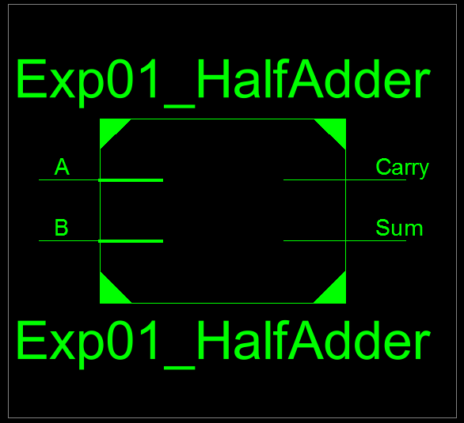
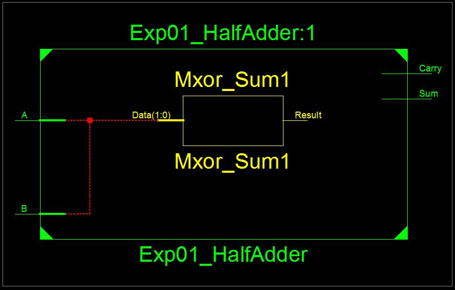
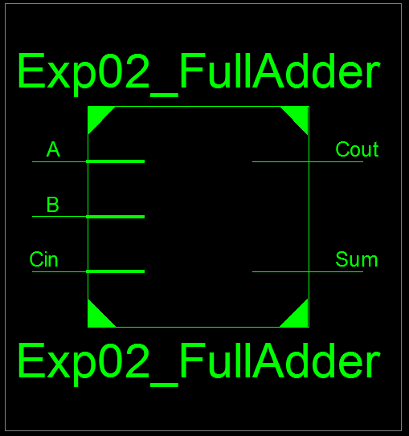
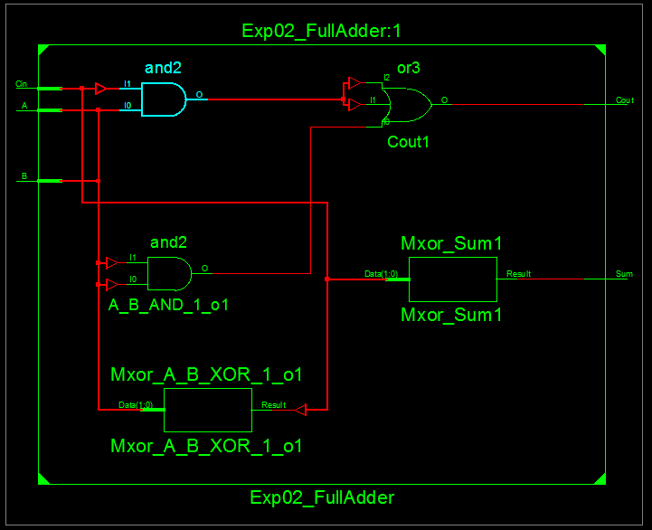
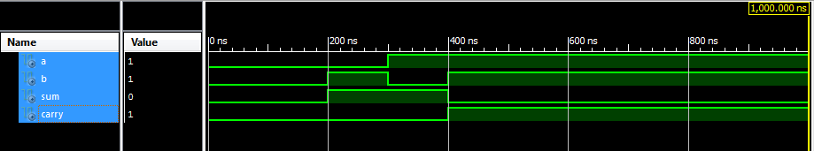
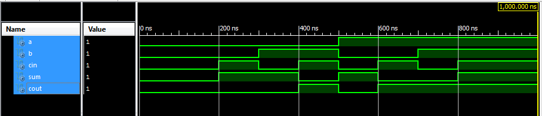

# Lab 02 - Adder Circuits Design

## Objective

1. To design and simulate half adder circuit.
2. To design and simulate full adder circuit.

## Theory

### Half Adder

A half adder is a combinational logic circuit that adds two single-bit binary numbers and produces a sum and carry output.

**Truth Table:**

| A | B | Sum | Carry |
|---|---|-----|-------|
| 0 | 0 | 0   | 0     |
| 0 | 1 | 1   | 0     |
| 1 | 0 | 1   | 0     |
| 1 | 1 | 0   | 1     |

**Logic Equations:**
- Sum = A ⊕ B (XOR)
- Carry = A · B (AND)

### Full Adder

A full adder is a combinational logic circuit that adds three single-bit binary numbers (two operands and a carry-in) and produces a sum and carry-out output.

**Truth Table:**

| A | B | Cin | Sum | Cout |
|---|---|-----|-----|------|
| 0 | 0 | 0   | 0   | 0    |
| 0 | 0 | 1   | 1   | 0    |
| 0 | 1 | 0   | 1   | 0    |
| 0 | 1 | 1   | 0   | 1    |
| 1 | 0 | 0   | 1   | 0    |
| 1 | 0 | 1   | 0   | 1    |
| 1 | 1 | 0   | 0   | 1    |
| 1 | 1 | 1   | 1   | 1    |

**Logic Equations:**
- Sum = A ⊕ B ⊕ Cin
- Cout = (A · B) + (Cin · (A ⊕ B))

A full adder can be implemented using two half adders and an OR gate.

---

## Source Code

### VHDL Module Code for Half Adder

```vhdl
----------------------------------------------------------------------------------
-- Module Name:    Exp01_HalfAdder - Behavioral 
----------------------------------------------------------------------------------
library IEEE;
use IEEE.STD_LOGIC_1164.ALL;

entity Exp01_HalfAdder is
    Port ( A : in  STD_LOGIC;
           B : in  STD_LOGIC;
           Sum : out  STD_LOGIC;
           Carry : out  STD_LOGIC);
end Exp01_HalfAdder;

architecture Behavioral of Exp01_HalfAdder is

begin
    -- Sum is the XOR of A and B
    SUM <= A XOR B;
    
    -- Carry is the AND of A and B
    CARRY <= A AND B;

end Behavioral;
```

**Output:**



*Figure 1: RTL Schematic Block of Half Adder*



*Figure 2: RTL Schematic Diagram of Half Adder*

### VHDL Module Code for Full Adder
```vhdl
----------------------------------------------------------------------------------
-- Module Name:    Exp02_FullAdder - Behavioral 
----------------------------------------------------------------------------------
library IEEE;
use IEEE.STD_LOGIC_1164.ALL;

entity Exp02_FullAdder is
    Port ( A : in  STD_LOGIC;
           B : in  STD_LOGIC;
           Cin : in  STD_LOGIC;
           Sum : out  STD_LOGIC;
           Cout : out  STD_LOGIC);
end Exp02_FullAdder;

architecture Behavioral of Exp02_FullAdder is

begin
    -- Sum is the XOR of A, B, and Cin
    Sum <= A XOR B XOR Cin;
    
    -- Carry output is generated by:
    -- (A AND B) OR (B AND Cin) OR (A AND Cin)
    Cout <= (A AND B) OR (B AND Cin) OR (A AND Cin);

end Behavioral;
```

**Output:**



*Figure 3: RTL Schematic Block of Full Adder*



*Figure 4: RTL Schematic Diagram of Full Adder*

### Test Bench Code for Half Adder

```vhdl
--------------------------------------------------------------------------------
-- VHDL Test Bench Created by ISE for module: Exp01_HalfAdder
--------------------------------------------------------------------------------
LIBRARY ieee;
USE ieee.std_logic_1164.ALL;
 
ENTITY Exp03_HalfAdderTB IS
END Exp03_HalfAdderTB;
 
ARCHITECTURE behavior OF Exp03_HalfAdderTB IS 
 
    -- Component Declaration for the Unit Under Test (UUT)
 
    COMPONENT Exp01_HalfAdder
    PORT(
         A : IN  std_logic;
         B : IN  std_logic;
         Sum : OUT  std_logic;
         Carry : OUT  std_logic
        );
    END COMPONENT;
    

   --Inputs
   signal A : std_logic := '0';
   signal B : std_logic := '0';

 	--Outputs
   signal Sum : std_logic;
   signal Carry : std_logic;
 
BEGIN
 
	-- Instantiate the Unit Under Test (UUT)
   uut: Exp01_HalfAdder PORT MAP (
          A => A,
          B => B,
          Sum => Sum,
          Carry => Carry
        );
 

   -- Stimulus process
   stim_proc: process
   begin		
      -- hold reset state for 100 ns.
      wait for 100 ns;	
      -- insert stimulus here 
		-- Test case 1: A = '0', B = '0'
		A <= '0'; B <= '0';
		wait for 100 ns;

		-- Test case 2: A = '0', B = '1'
		A <= '0'; B <= '1';
		wait for 100 ns;

		-- Test case 3: A = '1', B = '0'
		A <= '1'; B <= '0';
		wait for 100 ns;

		-- Test case 4: A = '1', B = '1'
		A <= '1'; B <= '1';
		wait for 100 ns;

      wait;
   end process;

END;
```

**Output:**



*Figure 7: Test Bench for Half Adder*

### Test Bench Code for Full Adder

```vhdl
--------------------------------------------------------------------------------
-- VHDL Test Bench Created by ISE for module: Exp02_FullAdder
--------------------------------------------------------------------------------
LIBRARY ieee;
USE ieee.std_logic_1164.ALL;
 
ENTITY Exp04_FullAdderTB IS
END Exp04_FullAdderTB;
 
ARCHITECTURE behavior OF Exp04_FullAdderTB IS 
 
    -- Component Declaration for the Unit Under Test (UUT)
 
    COMPONENT Exp02_FullAdder
    PORT(
         A : IN  std_logic;
         B : IN  std_logic;
         Cin : IN  std_logic;
         Sum : OUT  std_logic;
         Cout : OUT  std_logic
        );
    END COMPONENT;
    

   --Inputs
   signal A : std_logic := '0';
   signal B : std_logic := '0';
   signal Cin : std_logic := '0';

 	--Outputs
   signal Sum : std_logic;
   signal Cout : std_logic;
 
BEGIN
 
	-- Instantiate the Unit Under Test (UUT)
   uut: Exp02_FullAdder PORT MAP (
          A => A,
          B => B,
          Cin => Cin,
          Sum => Sum,
          Cout => Cout
        );

   -- Stimulus process
   stim_proc: process
   begin		
      -- hold reset state for 100 ns.
      wait for 100 ns;	
      -- insert stimulus here 
		-- Test case 1: A = '0', B = '0', Cin = '0'
		A <= '0'; B <= '0'; Cin <= '0';
		wait for 100 ns;

		-- Test case 2: A = '0', B = '0', Cin = '1'
		A <= '0'; B <= '0'; Cin <= '1';
		wait for 100 ns;

		-- Test case 3: A = '0', B = '1', Cin = '0'
		A <= '0'; B <= '1'; Cin <= '0';
		wait for 100 ns;

		-- Test case 4: A = '0', B = '1', Cin = '1'
		A <= '0'; B <= '1'; Cin <= '1';
		wait for 100 ns;

		-- Test case 5: A = '1', B = '0', Cin = '0'
		A <= '1'; B <= '0'; Cin <= '0';
		wait for 100 ns;

		-- Test case 6: A = '1', B = '0', Cin = '1'
		A <= '1'; B <= '0'; Cin <= '1';
		wait for 100 ns;

		-- Test case 7: A = '1', B = '1', Cin = '0'
		A <= '1'; B <= '1'; Cin <= '0';
		wait for 100 ns;

		-- Test case 8: A = '1', B = '1', Cin = '1'
		A <= '1'; B <= '1'; Cin <= '1';

      wait;
   end process;

END;
```

**Output:**



*Figure 7: Test Bench for Full Adder*

---

## Discussion and Conclusion

In this lab experiment, we learned to design the half adder and full adder circuit using VHDL.
Also, we write the test bench code for both circuits and simulated the output signals based on input logics.

---

[Download Outputs PDF](../../docs/lab02/outputs.pdf)