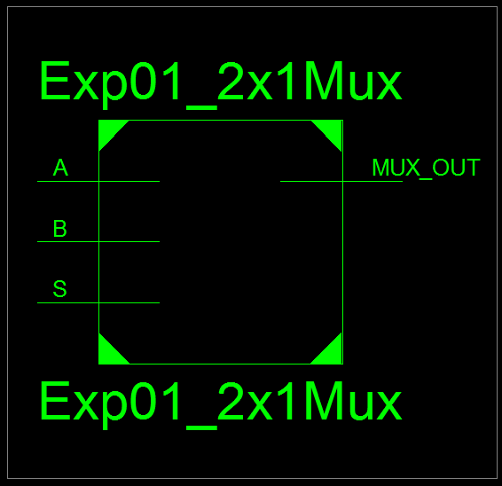
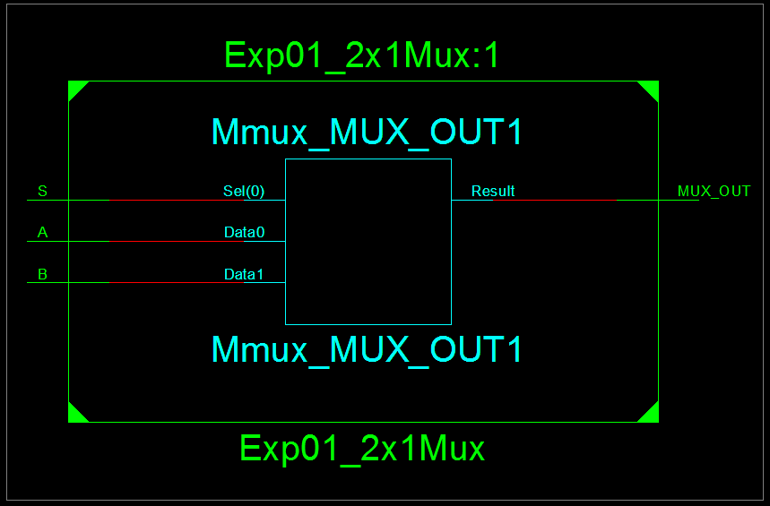
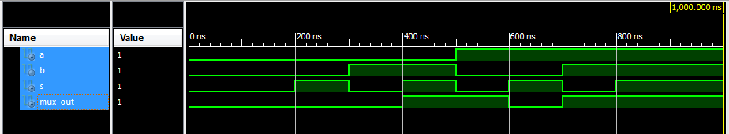
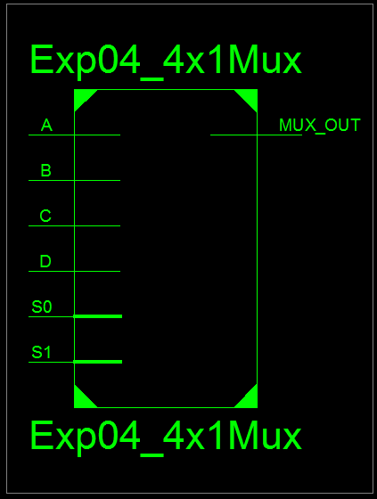
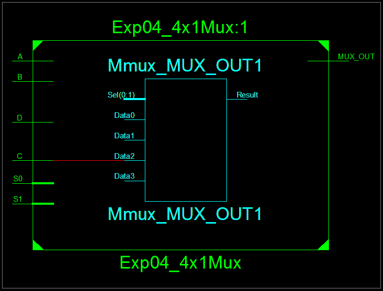
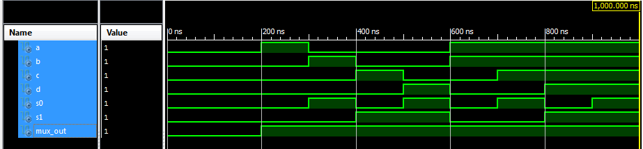

# Lab 03 - Behavioural Modeling of Multiplexer

## Objective

1. To design and simulate 2x1 Mux.
2. To design and simulate 4x1 Mux.

---

## Theory

### Behavioural Modeling

**Defination:** Describes what a circuit does rather than how it is physically connected.

**Focus:** Logic behaviour, algorithms, and signal operations.

**How:** Uses processes, if-else, case statements, loops, and signal assignments.

**Advantages:**
* Easier and faster to write for complex logic.
* Focus on functionality rather than hardware connections.

**Example:**
```vhdl
ARCHITECTURE behavior OF AND_Gate IS
BEGIN
    process(A, B)
    BEGIN
        Y <= A AND B;
    END process;
END behavior;
```

---

## Source Code

### VHDL Module Code for 2:1 Mux

```vhdl
----------------------------------------------------------------------------------
-- Module Name:    Exp01_2x1Mux - Behavioral 
----------------------------------------------------------------------------------
library IEEE;
use IEEE.STD_LOGIC_1164.ALL;

entity Exp01_2x1Mux is
    Port ( A : in  STD_LOGIC;
           B : in  STD_LOGIC;
           S : in  STD_LOGIC;
           MUX_OUT : out  STD_LOGIC);
end Exp01_2x1Mux;

architecture Behavioral of Exp01_2x1Mux is

begin
    -- MUX logic: if S = '0' select input A, else select input B
    MUX_OUT <= A when S = '0' else B;

end Behavioral;
```

**Output:**



*Figure 1: RTL Schematic Block of 2:1 Mux*



*Figure 2: RTL Schematic Diagram of 2:1 Mux*

## Test Bench Code for 2:1 Mux

```vhdl
--------------------------------------------------------------------------------
-- VHDL Test Bench Created by ISE for module: Exp01_2x1Mux
--------------------------------------------------------------------------------
LIBRARY ieee;
USE ieee.std_logic_1164.ALL;
 
ENTITY Exp02_2x1MuxTB IS
END Exp02_2x1MuxTB;
 
ARCHITECTURE behavior OF Exp02_2x1MuxTB IS 
 
    -- Component Declaration for the Unit Under Test (UUT)
 
    COMPONENT Exp01_2x1Mux
    PORT(
         A : IN  std_logic;
         B : IN  std_logic;
         S : IN  std_logic;
         MUX_OUT : OUT  std_logic
        );
    END COMPONENT;
    

   --Inputs
   signal A : std_logic := '0';
   signal B : std_logic := '0';
   signal S : std_logic := '0';

 	--Outputs
   signal MUX_OUT : std_logic;
 
BEGIN
 
	-- Instantiate the Unit Under Test (UUT)
   uut: Exp01_2x1Mux PORT MAP (
          A => A,
          B => B,
          S => S,
          MUX_OUT => MUX_OUT
        );
 

   -- Stimulus process
   stim_proc: process
   begin		
      -- hold reset state for 100 ns.
      wait for 100 ns;	

      -- insert stimulus here 
		-- Test case 1: A = '0', B = '0', S = '0' (select A)
		A <= '0'; B <= '0'; S <= '0';
		wait for 100 ns;

		-- Test case 2: A = '0', B = '0', S = '1' (select B)
		A <= '0'; B <= '0'; S <= '1';
		wait for 100 ns;

		-- Test case 3: A = '0', B = '1', S = '0' (select A)
		A <= '0'; B <= '1'; S <= '0';
		wait for 100 ns;

		-- Test case 4: A = '0', B = '1', S = '1' (select B)
		A <= '0'; B <= '1'; S <= '1';
		wait for 100 ns;

		-- Test case 5: A = '1', B = '0', S = '0' (select A)
		A <= '1'; B <= '0'; S <= '0';
		wait for 100 ns;

		-- Test case 6: A = '1', B = '0', S = '1' (select B)
		A <= '1'; B <= '0'; S <= '1';
		wait for 100 ns;

		-- Test case 7: A = '1', B = '1', S = '0' (select A)
		A <= '1'; B <= '1'; S <= '0';
		wait for 100 ns;

		-- Test case 8: A = '1', B = '1', S = '1' (select B)
		A <= '1'; B <= '1'; S <= '1';

      wait;
   end process;

END;
```

**Output:**



*Figure 3: Test Bench for 2:1 Mux*

### VHDL Module Code for 4:1 Mux

```vhdl
----------------------------------------------------------------------------------
-- Module Name:    Exp03_4x1Mux - Behavioral 
----------------------------------------------------------------------------------
library IEEE;
use IEEE.STD_LOGIC_1164.ALL;

entity Exp03_4x1Mux is
    Port ( A : in  STD_LOGIC;
           B : in  STD_LOGIC;
           C : in  STD_LOGIC;
           D : in  STD_LOGIC;
           S0 : in  STD_LOGIC;
           S1 : in  STD_LOGIC;
           MUX_OUT : out  STD_LOGIC);
end Exp03_4x1Mux;

architecture Behavioral of Exp03_4x1Mux is

begin
    -- MUX logic: select one of A, B, C, D based on S1 and S0
    process (A, B, C, D, S0, S1)
    begin
        case (S1 & S0) is
            when "00" => MUX_OUT <= A;   -- Select A when S1S0 = "00"
            when "01" => MUX_OUT <= B;   -- Select B when S1S0 = "01"
            when "10" => MUX_OUT <= C;   -- Select C when S1S0 = "10"
            when "11" => MUX_OUT <= D;   -- Select D when S1S0 = "11"
        end case;
    end process;
end Behavioral;
```

**Alternative Code:**
```vhdl
----------------------------------------------------------------------------------
-- Module Name:    Exp03_Alt_4x1Mux - Behavioral 
----------------------------------------------------------------------------------
library IEEE;
use IEEE.STD_LOGIC_1164.ALL;

entity Exp03_Alt_4x1Mux is
    Port ( A : in  STD_LOGIC;
           B : in  STD_LOGIC;
           C : in  STD_LOGIC;
           D : in  STD_LOGIC;
           S0 : in  STD_LOGIC;
           S1 : in  STD_LOGIC;
           MUX_OUT : out  STD_LOGIC);
end Exp03_Alt_4x1Mux;

architecture Behavioral of Exp03_Alt_4x1Mux is

begin
    -- MUX logic: select one of A, B, C, D based on S1 and S0
    process (S1, S0, A, B, C, D)  -- Sensitivity list optimized for used signals
    variable select_line : STD_LOGIC_VECTOR(1 downto 0);  -- Create a 2-bit vector for the select lines
    begin
        -- Concatenate S1 and S0 into the select_line variable
        select_line := S1 & S0;

        -- Now, perform the case statement on the concatenated select_line
        case select_line is
            when "00" => MUX_OUT <= A;   -- Select A when S1S0 = "00"
            when "01" => MUX_OUT <= B;   -- Select B when S1S0 = "01"
            when "10" => MUX_OUT <= C;   -- Select C when S1S0 = "10"
            when "11" => MUX_OUT <= D;   -- Select D when S1S0 = "11"
            when others => MUX_OUT <= 'X'; -- Undefined state (safety catch)
        end case;
    end process;
end Behavioral;
```

**Output:**



*Figure 4: RTL Schematic Block of 4:1 Mux*



*Figure 5: RTL Schematic Diagram of 4:1 Mux*

## Test Bench Code for 4:1 Mux

```vhdl
--------------------------------------------------------------------------------
-- VHDL Test Bench Created by ISE for module: Exp04_4x1Mux
--------------------------------------------------------------------------------
LIBRARY ieee;
USE ieee.std_logic_1164.ALL;
 
ENTITY Exp04_4x1MuxTB IS
END Exp04_4x1MuxTB;
 
ARCHITECTURE behavior OF Exp04_4x1MuxTB IS 
 
    -- Component Declaration for the Unit Under Test (UUT)
 
    COMPONENT Exp04_4x1Mux
    PORT(
         A : IN  std_logic;
         B : IN  std_logic;
         C : IN  std_logic;
         D : IN  std_logic;
         S0 : IN  std_logic;
         S1 : IN  std_logic;
         MUX_OUT : OUT  std_logic
        );
    END COMPONENT;
    

   --Inputs
   signal A : std_logic := '0';
   signal B : std_logic := '0';
   signal C : std_logic := '0';
   signal D : std_logic := '0';
   signal S0 : std_logic := '0';
   signal S1 : std_logic := '0';

 	--Outputs
   signal MUX_OUT : std_logic;
 
BEGIN
 
	-- Instantiate the Unit Under Test (UUT)
   uut: Exp04_4x1Mux PORT MAP (
          A => A,
          B => B,
          C => C,
          D => D,
          S0 => S0,
          S1 => S1,
          MUX_OUT => MUX_OUT
        );
 

   -- Stimulus process
   stim_proc: process
   begin		
      -- hold reset state for 100 ns.
      wait for 100 ns;	

      -- insert stimulus here 
		-- Test case 1: A = '0', B = '0', C = '0', D = '0', S1 = '0', S0 = '0' (select A)
		A <= '0'; B <= '0'; C <= '0'; D <= '0'; S1 <= '0'; S0 <= '0';
		wait for 100 ns;

		-- Test case 2: A = '1', B = '0', C = '0', D = '0', S1 = '0', S0 = '0' (select A)
		A <= '1'; B <= '0'; C <= '0'; D <= '0'; S1 <= '0'; S0 <= '0';
		wait for 100 ns;

		-- Test case 3: A = '0', B = '1', C = '0', D = '0', S1 = '0', S0 = '1' (select B)
		A <= '0'; B <= '1'; C <= '0'; D <= '0'; S1 <= '0'; S0 <= '1';
		wait for 100 ns;

		-- Test case 4: A = '0', B = '0', C = '1', D = '0', S1 = '1', S0 = '0' (select C)
		A <= '0'; B <= '0'; C <= '1'; D <= '0'; S1 <= '1'; S0 <= '0';
		wait for 100 ns;

		-- Test case 5: A = '0', B = '0', C = '0', D = '1', S1 = '1', S0 = '1' (select D)
		A <= '0'; B <= '0'; C <= '0'; D <= '1'; S1 <= '1'; S0 <= '1';
		wait for 100 ns;

		-- Test case 6: A = '1', B = '1', C = '0', D = '0', S1 = '0', S0 = '0' (select A)
		A <= '1'; B <= '1'; C <= '0'; D <= '0'; S1 <= '0'; S0 <= '0';
		wait for 100 ns;

		-- Test case 7: A = '1', B = '1', C = '1', D = '0', S1 = '0', S0 = '1' (select B)
		A <= '1'; B <= '1'; C <= '1'; D <= '0'; S1 <= '0'; S0 <= '1';
		wait for 100 ns;

		-- Test case 8: A = '1', B = '1', C = '1', D = '1', S1 = '1', S0 = '0' (select C)
		A <= '1'; B <= '1'; C <= '1'; D <= '1'; S1 <= '1'; S0 <= '0';
		wait for 100 ns;

		-- Test case 9: A = '1', B = '1', C = '1', D = '1', S1 = '1', S0 = '1' (select D)
		A <= '1'; B <= '1'; C <= '1'; D <= '1'; S1 <= '1'; S0 <= '1';

      wait;
   end process;

END;
```

**Output:**



*Figure 6: Test Bench for 4:1 Mux*

---

## Discussion and Conclusion

In this lab experiment, we learned about behavioral modeling. 
We designed 2:1 mux and 4:1 mux using the behavioral modeling. 
Also, we wrote the test bench code for both multiplexers and simulated the output signals based on input signals.

---

[Download Outputs PDF](../../docs/lab03/outputs.pdf)