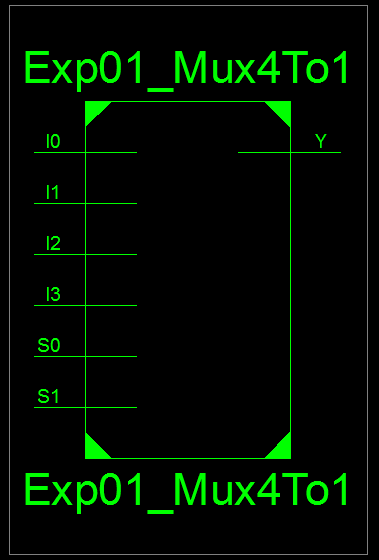
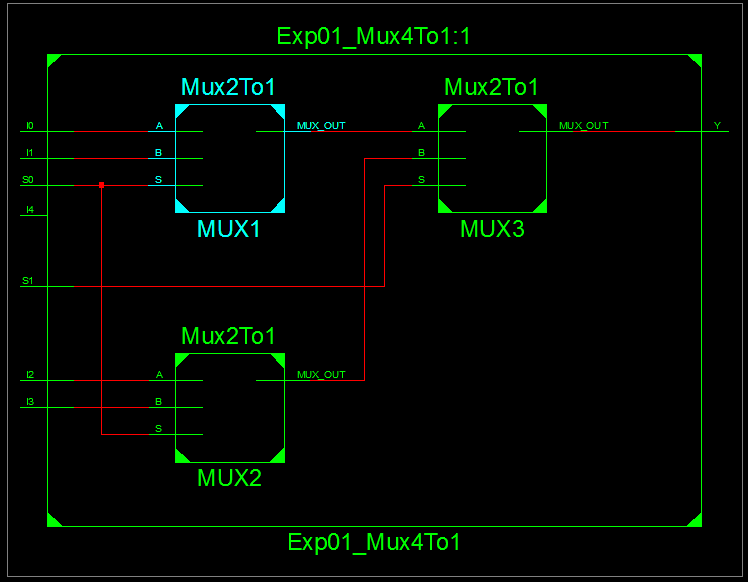
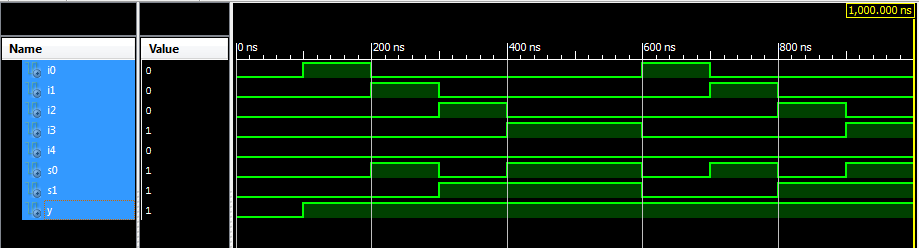
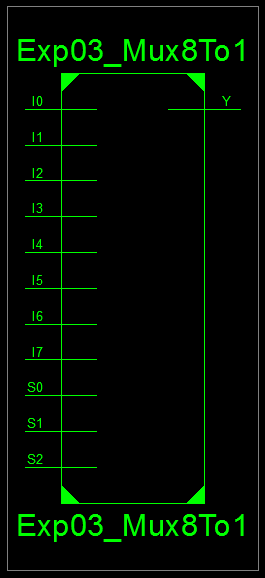
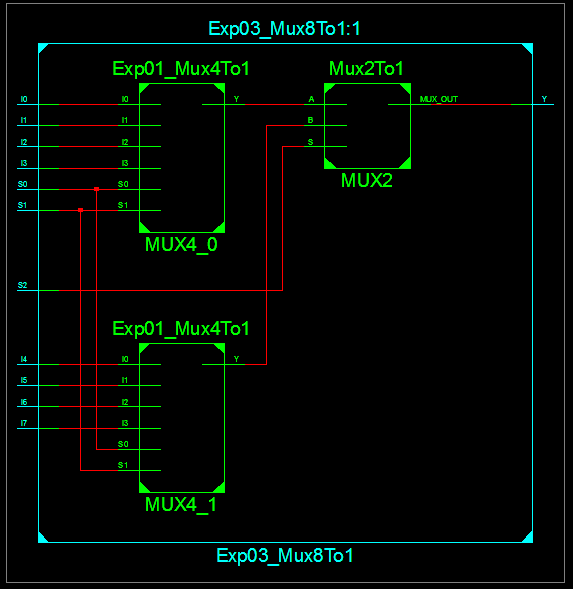
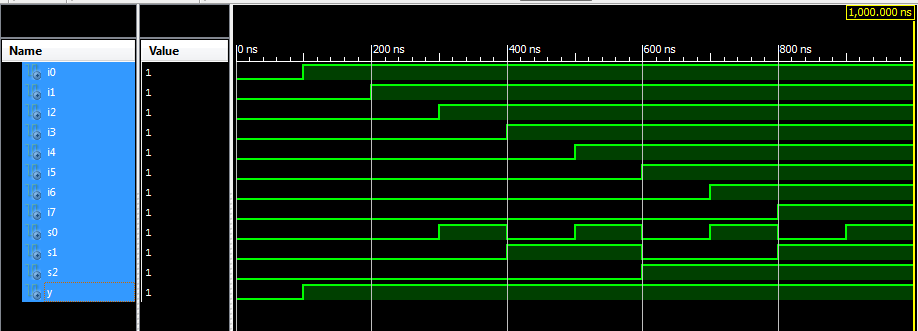

# Lab 04 - Structural Modeling of Multiplexer

## Objective

1. To design and simulate 4:1 mux using combination of 2:1 muxes.
2. To design and simulate 8:1 mux using combination of 4:1 muxes and 2:1 mux.

---

## Theory

### Structural Modeling

**Defination:** Describes how a circuit is built from components and their interconnections.

**Focus:** The hardware structure, using components, signals and port maps.

**How:** Instantiates sub-modules (components) and connects them via signals.

**Advantages:**
* Shows actual hardware connections.
* Useful for modular design and hierarchical modeling.

**Example:**
``vhdl
ARCHITECTURE structural of AND_Gate IS
    COMPONENT NAND_Gate
        PORT (
            A, B: IN std_logic;
            Y: OUT std_logic
        );
    END COMPONENT;

    SIGNAL N1: std_logic;

BEGIN
    U1 : NAND_Gate PORT MAP (
        A => A,
        B => B,
        Y => N1
    );

    Y <= NOT N1; -- Convert NAND to AND

END structural;

---

## Source Code

### Necessary Module: 2 To 1 Mux

```vhdl
----------------------------------------------------------------------------------
-- Module Name:    Exp01_2x1Mux - Behavioral 
----------------------------------------------------------------------------------
library IEEE;
use IEEE.STD_LOGIC_1164.ALL;

-- Uncomment the following library declaration if using
-- arithmetic functions with Signed or Unsigned values
--use IEEE.NUMERIC_STD.ALL;

-- Uncomment the following library declaration if instantiating
-- any Xilinx primitives in this code.
--library UNISIM;
--use UNISIM.VComponents.all;

entity Mux2To1 is
    Port ( A : in  STD_LOGIC;
           B : in  STD_LOGIC;
           S : in  STD_LOGIC;
           MUX_OUT : out  STD_LOGIC);
end Mux2To1;

architecture Behavioral of Mux2To1 is

begin
    -- MUX logic: if S = '0' select input A, else select input B
    MUX_OUT <= A when S = '0' else B;

end Behavioral;
```

### Experiment 1 - Design 4:1 Mux Using 2:1 Muxes

```vhdl
----------------------------------------------------------------------------------
-- Module Name:    Exp01_Mux4To1 - Structural 
----------------------------------------------------------------------------------
library IEEE;
use IEEE.STD_LOGIC_1164.ALL;

entity Exp01_Mux4To1 is
    Port ( I0 : in  STD_LOGIC;
           I1 : in  STD_LOGIC;
           I2 : in  STD_LOGIC;
           I3 : in  STD_LOGIC;
           S0 : in  STD_LOGIC;
           S1 : in  STD_LOGIC;
           Y : out  STD_LOGIC);
end Exp01_Mux4To1;


architecture Structural of Exp01_Mux4To1 is

    -- Component Declaration for 2:1 MUX
    component Mux2To1 is
        Port ( A : in  STD_LOGIC;
               B : in  STD_LOGIC;
               S : in  STD_LOGIC;
               MUX_OUT : out STD_LOGIC);
    end component;
    
    -- Signals for intermediate MUX outputs
    signal MUX1_out, MUX2_out : STD_LOGIC;
    
begin

    -- First level of 2:1 MUXes
    MUX1: Mux2To1 port map (I0, I1, S0, MUX1_out);  -- MUX1 selects between I0 and I1 based on S0
    MUX2: Mux2To1 port map (I2, I3, S0, MUX2_out);  -- MUX2 selects between I2 and I3 based on S0
    
    -- Second level of 2:1 MUX (final output Y)
    MUX3: Mux2To1 port map (MUX1_out, MUX2_out, S1, Y);  -- MUX3 selects between MUX1_out and MUX2_out based on S1

end Structural;
```

**Output:**



*Figure 1: RTL Schematic Block of 4:1 Mux*



*Figure 2: RTL Schematic Diagram of 4:1 Mux using 2:1 Muxes*

### Experiment 2 - Test Bench Code for 4:1 Mux

```vhdl
--------------------------------------------------------------------------------
-- VHDL Test Bench Created by ISE for module: Exp01_Mux4To1
----------------------------------------------------------
LIBRARY ieee;
USE ieee.std_logic_1164.ALL;
 
ENTITY Exp02_Mux4To1TB IS
END Exp02_Mux4To1TB;
 
ARCHITECTURE behavior OF Exp02_Mux4To1TB IS 
 
    -- Component Declaration for the Unit Under Test (UUT)
 
    COMPONENT Exp01_Mux4To1
    PORT(
         I0 : IN  std_logic;
         I1 : IN  std_logic;
         I2 : IN  std_logic;
         I3 : IN  std_logic;
         S0 : IN  std_logic;
         S1 : IN  std_logic;
         Y : OUT  std_logic
        );
    END COMPONENT;
    

   --Inputs
   signal I0 : std_logic := '0';
   signal I1 : std_logic := '0';
   signal I2 : std_logic := '0';
   signal I3 : std_logic := '0';
   signal S0 : std_logic := '0';
   signal S1 : std_logic := '0';

 	--Outputs
   signal Y : std_logic;
	
BEGIN
 
	-- Instantiate the Unit Under Test (UUT)
   uut: Exp01_Mux4To1 PORT MAP (
          I0 => I0,
          I1 => I1,
          I2 => I2,
          I3 => I3,
          S0 => S0,
          S1 => S1,
          Y => Y
        );

   -- Stimulus process
   stim_proc: process
   begin		
      -- hold reset state for 100 ns.
      wait for 100 ns;	

      -- insert stimulus here 
		-- Test case 1: Select I0
      I0 <= '1'; I1 <= '0'; I2 <= '0'; I3 <= '0';
      S1 <= '0'; S0 <= '0'; -- S1S0 = 00
      wait for 100 ns;
      assert (Y = I0) report "Test Case 1 Failed" severity error;

       -- Test case 2: Select I1
       I0 <= '0'; I1 <= '1'; I2 <= '0'; I3 <= '0';
       S1 <= '0'; S0 <= '1'; -- S1S0 = 01
       wait for 100 ns;
       assert (Y = I1) report "Test Case 2 Failed" severity error;

       -- Test case 3: Select I2
       I0 <= '0'; I1 <= '0'; I2 <= '1'; I3 <= '0';
       S1 <= '1'; S0 <= '0'; -- S1S0 = 10
       wait for 100 ns;
       assert (Y = I2) report "Test Case 3 Failed" severity error;

       -- Test case 4: Select I3
       I0 <= '0'; I1 <= '0'; I2 <= '0'; I3 <= '1';
       S1 <= '1'; S0 <= '1'; -- S1S0 = 11
       wait for 100 ns;
       assert (Y = I3) report "Test Case 4 Failed" severity error;

      --wait;
   end process;

END;
```

**Output:**



*Figure 3: Test Bench for 4:1 Mux*

### Experiment 3 - Structure Modeling of 8:1 Mux

```vhdl
----------------------------------------------------------------------------------
-- Module Name:    Exp03_Mux8To1 - Structural 
----------------------------------------------------------------------------------
library IEEE;
use IEEE.STD_LOGIC_1164.ALL;

entity Exp03_Mux8To1 is
    Port (
        I0 : in  STD_LOGIC;
        I1 : in  STD_LOGIC;
        I2 : in  STD_LOGIC;
        I3 : in  STD_LOGIC;
        I4 : in  STD_LOGIC;
        I5 : in  STD_LOGIC;
        I6 : in  STD_LOGIC;
        I7 : in  STD_LOGIC;
        S0 : in  STD_LOGIC;
        S1 : in  STD_LOGIC;
        S2 : in  STD_LOGIC;
        Y  : out STD_LOGIC
    );
end Exp03_Mux8To1;

architecture Structural of Exp03_Mux8To1 is

    -- Component declaration for 4:1 MUX
    component Exp01_Mux4To1 is
        Port (
            I0 : in  STD_LOGIC;
            I1 : in  STD_LOGIC;
            I2 : in  STD_LOGIC;
            I3 : in  STD_LOGIC;
            S0 : in  STD_LOGIC;
            S1 : in  STD_LOGIC;
            Y  : out STD_LOGIC
        );
    end component;

    -- Component declaration for 2:1 MUX
    component Mux2To1 is
        Port (
            A : in  STD_LOGIC;
            B : in  STD_LOGIC;
            S : in  STD_LOGIC;
            MUX_OUT : out STD_LOGIC
        );
    end component;

    -- Internal signals
    signal Y0, Y1 : STD_LOGIC;

begin

    -- First 4:1 MUX (I0 to I3)
    MUX4_0 : Exp01_Mux4To1
        port map (
            I0 => I0,
            I1 => I1,
            I2 => I2,
            I3 => I3,
            S0 => S0,
            S1 => S1,
            Y  => Y0
        );

    -- Second 4:1 MUX (I4 to I7)
    MUX4_1 : Exp01_Mux4To1
        port map (
            I0 => I4,
            I1 => I5,
            I2 => I6,
            I3 => I7,
            S0 => S0,
            S1 => S1,
            Y  => Y1
        );

    -- Final 2:1 MUX
    MUX2 : Mux2To1
        port map (
            A       => Y0,
            B       => Y1,
            S       => S2,
            MUX_OUT => Y
        );

end Structural;
```

**Output:**



*Figure 4: RTL Schematic Block of 8:1 Mux*



*Figure 5: RTL Schematic Diagram of 8:1 Mux using the Muxes*

### Experiment 4 - Test Bench Code for 8:1 Mux

```vhdl
--------------------------------------------------------------------------------
-- VHDL Test Bench Created by ISE for module: Exp03_Mux8To1
--------------------------------------------------------------------------------
LIBRARY ieee;
USE ieee.std_logic_1164.ALL;
 
ENTITY Exp04_Mux8To1TB IS
END Exp04_Mux8To1TB;
 
ARCHITECTURE behavior OF Exp04_Mux8To1TB IS 
 
    -- Component Declaration for the Unit Under Test (UUT)
 
    COMPONENT Exp03_Mux8To1
    PORT(
         I0 : IN  std_logic;
         I1 : IN  std_logic;
         I2 : IN  std_logic;
         I3 : IN  std_logic;
         I4 : IN  std_logic;
         I5 : IN  std_logic;
         I6 : IN  std_logic;
         I7 : IN  std_logic;
         S0 : IN  std_logic;
         S1 : IN  std_logic;
         S2 : IN  std_logic;
         Y : OUT  std_logic
        );
    END COMPONENT;
    

   --Inputs
   signal I0 : std_logic := '0';
   signal I1 : std_logic := '0';
   signal I2 : std_logic := '0';
   signal I3 : std_logic := '0';
   signal I4 : std_logic := '0';
   signal I5 : std_logic := '0';
   signal I6 : std_logic := '0';
   signal I7 : std_logic := '0';
   signal S0 : std_logic := '0';
   signal S1 : std_logic := '0';
   signal S2 : std_logic := '0';

 	--Outputs
   signal Y : std_logic;

 
BEGIN
 
	-- Instantiate the Unit Under Test (UUT)
   uut: Exp03_Mux8To1 PORT MAP (
          I0 => I0,
          I1 => I1,
          I2 => I2,
          I3 => I3,
          I4 => I4,
          I5 => I5,
          I6 => I6,
          I7 => I7,
          S0 => S0,
          S1 => S1,
          S2 => S2,
          Y => Y
        );
 

   -- Stimulus process
   stim_proc: process
   begin		
      -- hold reset state for 100 ns.
      wait for 100 ns;	

      -- insert stimulus here 
        
        -- Test case 1: I0 to I7 with S0, S1, S2
        I0 <= '1'; wait for 100 ns; -- Expected Y = I0
        S0 <= '0'; S1 <= '0'; S2 <= '0';
        
        I1 <= '1'; wait for 100 ns; -- Expected Y = I1
        S0 <= '1'; S1 <= '0'; S2 <= '0';
        
        I2 <= '1'; wait for 100 ns; -- Expected Y = I2
        S0 <= '0'; S1 <= '1'; S2 <= '0';
        
        I3 <= '1'; wait for 100 ns; -- Expected Y = I3
        S0 <= '1'; S1 <= '1'; S2 <= '0';
        
        I4 <= '1'; wait for 100 ns; -- Expected Y = I4
        S0 <= '0'; S1 <= '0'; S2 <= '1';
        
        I5 <= '1'; wait for 100 ns; -- Expected Y = I5
        S0 <= '1'; S1 <= '0'; S2 <= '1';
        
        I6 <= '1'; wait for 100 ns; -- Expected Y = I6
        S0 <= '0'; S1 <= '1'; S2 <= '1';
        
        I7 <= '1'; wait for 100 ns; -- Expected Y = I7
        S0 <= '1'; S1 <= '1'; S2 <= '1';

        -- End of simulation
      wait;
   end process;

END;
```

**Output:**



*Figure 3: Test Bench for 8:1 Mux*

---

## Discussion and Conclusion

In this lab experiment, we learned about structural modeling. 
We designed 4:1 Mux using combination of 2:1 Muxes and 8:1 Mux using combination of 4:1 Muxes and 2:1 Mux.
Also, we wrote the test bench code for both multiplexers and simulated the output signals based on input signals.

---

[Download Outputs PDF](../../docs/lab04/outputs.pdf)