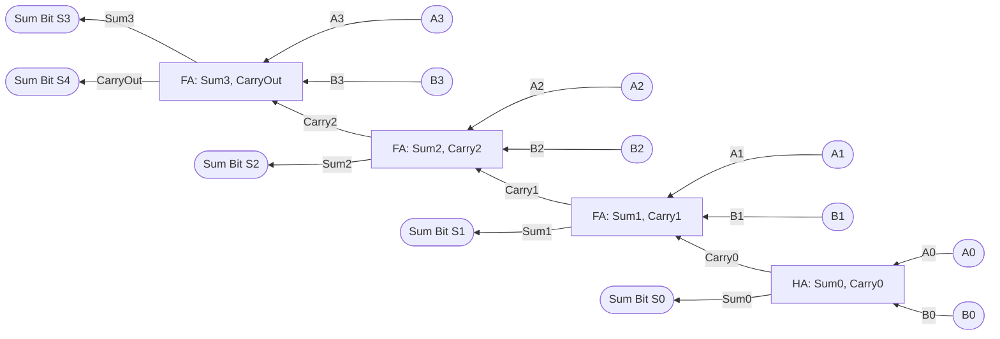
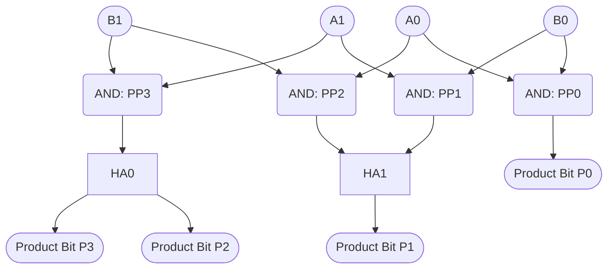
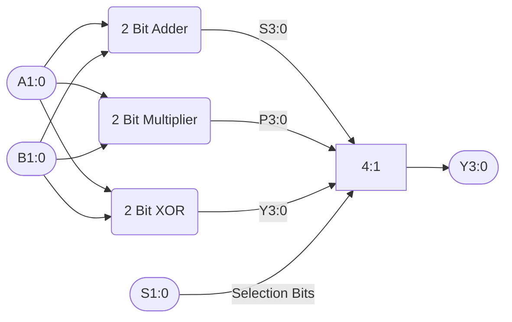
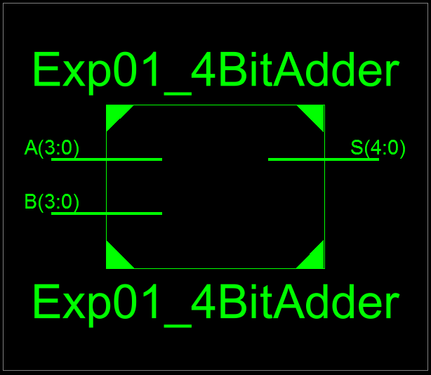
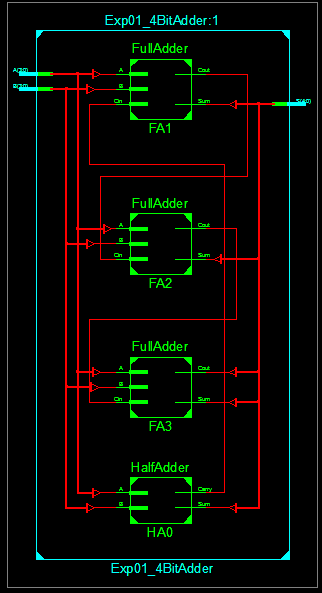
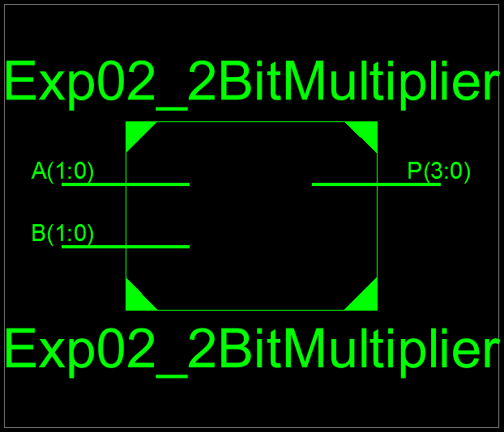
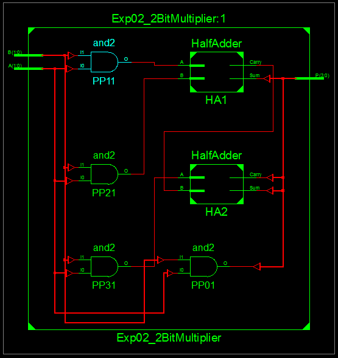
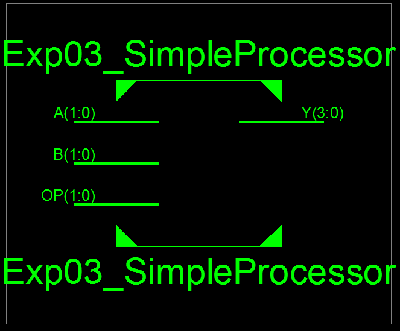
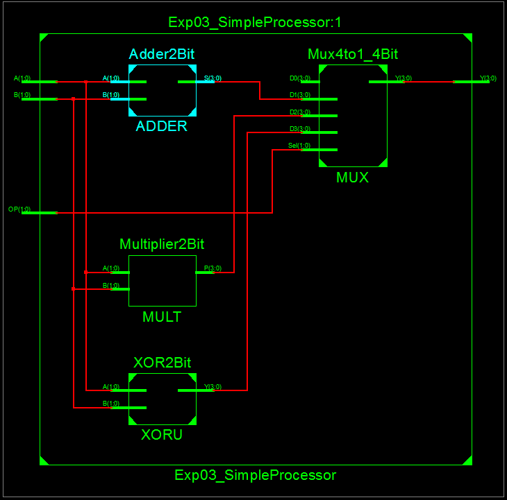

# Lab 05 - Combinational Circuit Design

## Objective

1. To design a 4 bit adder.
2. To design a 2 bit multiplier.
3. To design a simple processor.

---

## Theory

### Four Bit Adder

A 4-bit adder is a digital circuit that performs binary addition on two 4-bit numbers. It combines multiple full adders to add corresponding bits and propagate carry signals.

#### Components

- **Full Adder**: Adds three inputs (two bits + carry in) and produces sum and carry out
- **Propagation**: Carry signals ripple from LSB to MSB

#### Truth Table (Full Adder)
| A | B | Cin | Sum | Cout |
|---|---|-----|-----|------|
| 0 | 0 | 0   | 0   | 0    |
| 0 | 1 | 0   | 1   | 0    |
| 1 | 0 | 0   | 1   | 0    |
| 1 | 1 | 0   | 0   | 1    |
| 0 | 0 | 1   | 1   | 0    |
| 0 | 1 | 1   | 0   | 1    |
| 1 | 0 | 1   | 0   | 1    |
| 1 | 1 | 1   | 1   | 1    |

#### Circuit Diagram



#### Key Equations
- **Sum**: `S = A ⊕ B ⊕ Cin`
- **Carry Out**: `Cout = (A·B) + (Cin·(A⊕B))`

### Two Bit Multiplier

A 2-bit multiplier is a digital circuit that performs binary multiplication on two 2-bit numbers. It generates partial products using AND gates and combines them using adders to produce a 4-bit result.

#### Components

- **AND Gates**: Generate partial products by multiplying each bit of one operand with each bit of the other
- **Half Adders**: Combine partial products and handle carry propagation
- **Output**: 4-bit product (P3 P2 P1 P0)

#### Truth Table (2-bit Multiplier)
| A1 | A0 | B1 | B0 | P3 | P2 | P1 | P0 |
|----|----|----|----|----|----|----|----| 
| 0  | 0  | 0  | 0  | 0  | 0  | 0  | 0  |
| 0  | 1  | 0  | 1  | 0  | 0  | 0  | 1  |
| 1  | 0  | 1  | 0  | 1  | 0  | 0  | 0  |
| 1  | 1  | 1  | 1  | 1  | 0  | 0  | 1  |
| 0  | 1  | 1  | 0  | 0  | 0  | 1  | 0  |
| 1  | 0  | 0  | 1  | 0  | 0  | 1  | 0  |
| 1  | 1  | 0  | 1  | 0  | 1  | 1  | 0  |
| 1  | 1  | 1  | 0  | 0  | 1  | 1  | 0  |
| 1  | 1  | 1  | 1  | 1  | 1  | 0  | 1  |

#### Circuit Diagram



### Simple Processor

Design a simple processor in VHDL that accepts two 2 bit numbers and performs operations based on opcodes as shown below:

| Opcode | Operation |
|--------|-----------|
| 00     | No Operation |
| 01     | Binary Addition |
| 10     | Binary Multiplication |
| 11     | Logical Xoring |

#### Circuit Diagram



---

## Source Code

### Necessary Modules

**Half Adder - Behavioral:**
```vhdl
----------------------------------------------------------------------------------
-- Module Name:    HalfAdder - Behavioral 
----------------------------------------------------------------------------------
library IEEE;
use IEEE.STD_LOGIC_1164.ALL;

entity HalfAdder is
    Port ( A : in  STD_LOGIC;
           B : in  STD_LOGIC;
           Sum : out  STD_LOGIC;
           Carry : out  STD_LOGIC);
end HalfAdder;

architecture Behavioral of HalfAdder is
begin
    Sum   <= A xor B;
    Carry <= A and B;
end Behavioral;
```

**Full Adder - Behavioral:**
```vhdl
----------------------------------------------------------------------------------
-- Module Name:    FullAdder - Behavioral 
----------------------------------------------------------------------------------
library IEEE;
use IEEE.STD_LOGIC_1164.ALL;

entity FullAdder is
    Port ( A : in  STD_LOGIC;
           B : in  STD_LOGIC;
           Cin : in  STD_LOGIC;
           Sum : out  STD_LOGIC;
           Cout : out  STD_LOGIC);
end FullAdder;

architecture Behavioral of FullAdder is
begin
    Sum  <= A xor B xor Cin;
    Cout <= (A and B) or (B and Cin) or (A and Cin);
end Behavioral;
```

**XOR 2 Bit - Behavioral:**
```vhdl
----------------------------------------------------------------------------------
-- Module Name:    XOR2Bit - Behavioral 
----------------------------------------------------------------------------------
library IEEE;
use IEEE.STD_LOGIC_1164.ALL;

entity XOR2Bit is
    Port (
        A : in  STD_LOGIC_VECTOR (1 downto 0);
        B : in  STD_LOGIC_VECTOR (1 downto 0);
        Y : out STD_LOGIC_VECTOR (3 downto 0)
    );
end XOR2Bit;

architecture Behavioral of XOR2Bit is
begin
    Y(0) <= A(0) xor B(0);
    Y(1) <= A(1) xor B(1);
    Y(3 downto 2) <= "00";
end Behavioral;
```

**Mux 4:1 (4 Bit) - Behavioral:**
```vhdl
----------------------------------------------------------------------------------
-- Module Name:    Mux4to1_4Bit - Behavioral 
----------------------------------------------------------------------------------
library IEEE;
use IEEE.STD_LOGIC_1164.ALL;

entity Mux4to1_4Bit is
    Port (
        D0, D1, D2, D3 : in  STD_LOGIC_VECTOR (3 downto 0);
        Sel            : in  STD_LOGIC_VECTOR (1 downto 0);
        Y              : out STD_LOGIC_VECTOR (3 downto 0)
    );
end Mux4to1_4Bit;

architecture Behavioral of Mux4to1_4Bit is

begin
    process (D0, D1, D2, D3, Sel)
    begin
        case Sel is
            when "00" => Y <= D0; -- NOP
            when "01" => Y <= D1; -- ADD
            when "10" => Y <= D2; -- MUL
            when "11" => Y <= D3; -- XOR
            when others => Y <= "0000";
        end case;
    end process;

end Behavioral;
```

**2 Bit Adder - Structural:**
```vhdl
----------------------------------------------------------------------------------
-- Module Name:    Adder2Bit - Structural 
----------------------------------------------------------------------------------
library IEEE;
use IEEE.STD_LOGIC_1164.ALL;

entity Adder2Bit is
    Port (
        A : in  STD_LOGIC_VECTOR (1 downto 0);
        B : in  STD_LOGIC_VECTOR (1 downto 0);
        S : out STD_LOGIC_VECTOR (3 downto 0)
    );
end Adder2Bit;

architecture Structural of Adder2Bit is

    component HalfAdder
        Port ( A, B : in STD_LOGIC;
               Sum, Carry : out STD_LOGIC );
    end component;

    component FullAdder
        Port ( A, B, Cin : in STD_LOGIC;
               Sum, Cout : out STD_LOGIC );
    end component;

    signal C1 : STD_LOGIC;

begin
    -- Bit 0
    HA0: HalfAdder
        port map (A(0), B(0), S(0), C1);

    -- Bit 1
    FA1: FullAdder
        port map (A(1), B(1), C1, S(1), S(2));

    -- MSB unused
    S(3) <= '0';

end Structural;
```

### Experiment 1 - Four Bit Adder

```vhdl
----------------------------------------------------------------------------------
-- Module Name:    Exp01_4BitAdder - Structural 
----------------------------------------------------------------------------------
library IEEE;
use IEEE.STD_LOGIC_1164.ALL;

entity Exp01_4BitAdder is
    Port ( A : in  STD_LOGIC_VECTOR (3 downto 0);
           B : in  STD_LOGIC_VECTOR (3 downto 0);
           S : out  STD_LOGIC_VECTOR (4 downto 0));
end Exp01_4BitAdder;

architecture Structural of Exp01_4BitAdder is

    -- Component declarations
    component HalfAdder
        Port (
            A     : in  STD_LOGIC;
            B     : in  STD_LOGIC;
            Sum   : out STD_LOGIC;
            Carry : out STD_LOGIC
        );
    end component;

    component FullAdder
        Port (
            A    : in  STD_LOGIC;
            B    : in  STD_LOGIC;
            Cin  : in  STD_LOGIC;
            Sum  : out STD_LOGIC;
            Cout : out STD_LOGIC
        );
    end component;

    -- Internal carry signals
    signal C1, C2, C3 : STD_LOGIC;

begin

    -- Bit 0: Half Adder
    HA0: HalfAdder
        port map (
            A     => A(0),
            B     => B(0),
            Sum   => S(0),
            Carry => C1
        );

    -- Bit 1: Full Adder
    FA1: FullAdder
        port map (
            A    => A(1),
            B    => B(1),
            Cin  => C1,
            Sum  => S(1),
            Cout => C2
        );

    -- Bit 2: Full Adder
    FA2: FullAdder
        port map (
            A    => A(2),
            B    => B(2),
            Cin  => C2,
            Sum  => S(2),
            Cout => C3
        );

    -- Bit 3: Full Adder
    FA3: FullAdder
        port map (
            A    => A(3),
            B    => B(3),
            Cin  => C3,
            Sum  => S(3),
            Cout => S(4)
        );

end Structural;
```

**Output:**



*Figure 1: RTL Schematic Block of Four Bit Adder*



*Figure 2: RTL Schematic Diagram of Four Bit Adder*

### Experiment 2 - Two Bit Multiplier

```vhdl
----------------------------------------------------------------------------------
-- Module Name:    Exp02_2BitMultiplier - Structural 
----------------------------------------------------------------------------------
library IEEE;
use IEEE.STD_LOGIC_1164.ALL;

entity Exp02_2BitMultiplier is
    Port ( A : in  STD_LOGIC_VECTOR (1 downto 0);
           B : in  STD_LOGIC_VECTOR (1 downto 0);
           P : out  STD_LOGIC_VECTOR (3 downto 0));
end Exp02_2BitMultiplier;

architecture Structural of Exp02_2BitMultiplier is

    -- Half Adder component
    component HalfAdder
        Port (
            A     : in  STD_LOGIC;
            B     : in  STD_LOGIC;
            Sum   : out STD_LOGIC;
            Carry : out STD_LOGIC
        );
    end component;

    -- Internal signals (partial products & carries)
    signal PP0, PP1, PP2, PP3 : STD_LOGIC;
    signal C1 : STD_LOGIC;

begin

    -- Partial products (AND gates)
    PP0 <= A(0) and B(0);
    PP1 <= A(1) and B(0);
    PP2 <= A(0) and B(1);
    PP3 <= A(1) and B(1);

    -- Least significant bit
    P(0) <= PP0;

    -- First Half Adder (PP1 + PP2)
    HA1: HalfAdder
        port map (
            A     => PP1,
            B     => PP2,
            Sum   => P(1),
            Carry => C1
        );

    -- Second Half Adder (PP3 + Carry)
    HA2: HalfAdder
        port map (
            A     => PP3,
            B     => C1,
            Sum   => P(2),
            Carry => P(3)
        );

end Structural;
```

**Output:**



*Figure 3: RTL Schematic Block of Two Bit Multiplier*



*Figure 4: RTL Schematic Diagram of Two Bit Multiplier*

### Experiment 3 - Simple Processor

```vhdl
----------------------------------------------------------------------------------
-- Module Name:    Exp03_SimpleProcessor - Structural 
----------------------------------------------------------------------------------
library IEEE;
use IEEE.STD_LOGIC_1164.ALL;

entity Exp03_SimpleProcessor is
    Port ( A : in  STD_LOGIC_VECTOR (1 downto 0);
           B : in  STD_LOGIC_VECTOR (1 downto 0);
           OP : in  STD_LOGIC_VECTOR (1 downto 0);
           Y : out  STD_LOGIC_VECTOR (3 downto 0));
end Exp03_SimpleProcessor;

architecture Structural of Exp03_SimpleProcessor is

    component Adder2Bit
        Port ( A, B : in STD_LOGIC_VECTOR (1 downto 0);
               S    : out STD_LOGIC_VECTOR (3 downto 0) );
    end component;

    component Multiplier2Bit
        Port ( A, B : in STD_LOGIC_VECTOR (1 downto 0);
               P    : out STD_LOGIC_VECTOR (3 downto 0) );
    end component;

    component XOR2Bit
        Port ( A, B : in STD_LOGIC_VECTOR (1 downto 0);
               Y    : out STD_LOGIC_VECTOR (3 downto 0) );
    end component;

    component Mux4to1_4Bit
        Port ( D0, D1, D2, D3 : in STD_LOGIC_VECTOR (3 downto 0);
               Sel            : in STD_LOGIC_VECTOR (1 downto 0);
               Y              : out STD_LOGIC_VECTOR (3 downto 0) );
    end component;

    signal NOP_OUT, ADD_OUT, MUL_OUT, XOR_OUT : STD_LOGIC_VECTOR (3 downto 0);

begin

    -- No Operation
    NOP_OUT <= "0000";

    -- Addition
    ADDER: Adder2Bit
        port map (A, B, ADD_OUT);

    -- Multiplication
    MULT: Multiplier2Bit
        port map (A, B, MUL_OUT);

    -- XOR
    XORU: XOR2Bit
        port map (A, B, XOR_OUT);

    -- Opcode selection
    MUX: Mux4to1_4Bit
        port map (
            D0  => NOP_OUT,
            D1  => ADD_OUT,
            D2  => MUL_OUT,
            D3  => XOR_OUT,
            Sel => OP,
            Y   => Y
        );

end Structural;
```

**Output:**



*Figure 5: RTL Schematic Block of Simple Processor*



*Figure 6: RTL Schematic Diagram of Simple Processor*

---

## Discussion and Conclusion

In this lab experiment we learned to design 4 bit binary adder, 2 bit binary multiplier and a 2 bit simple processor with given opcodes.

---

[Download Outputs PDF](../../docs/lab05/outputs.pdf)