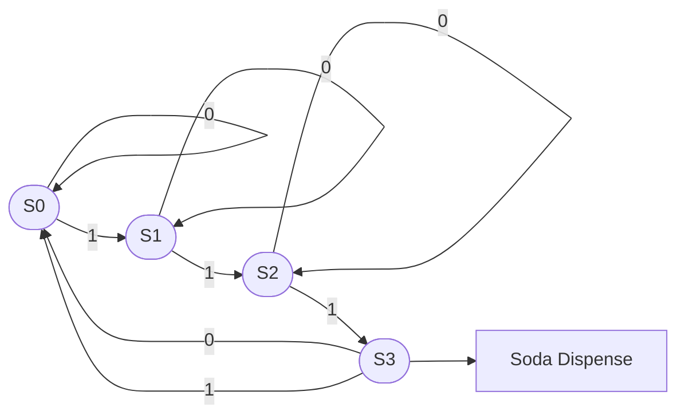
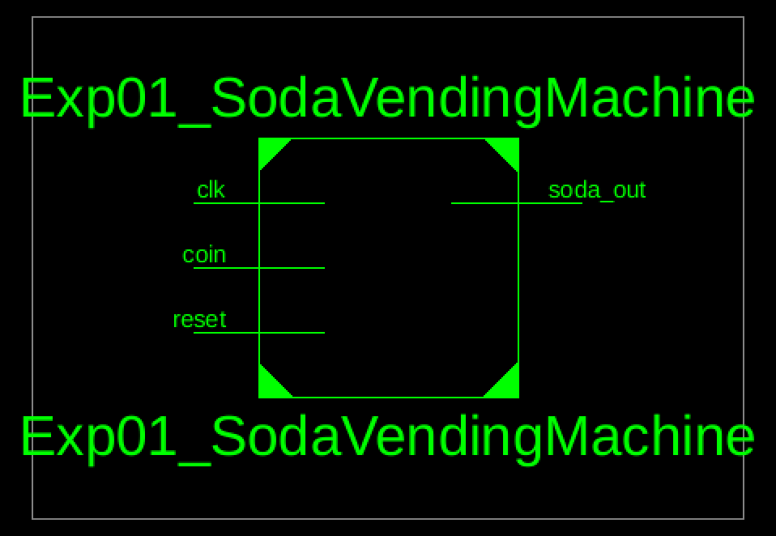
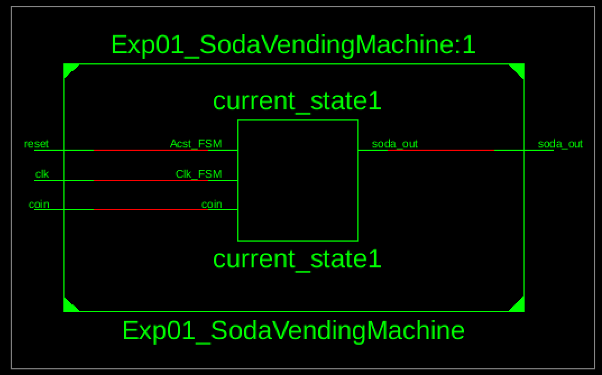

# Lab 7 - Soda Vending Machine

## Objective

To design a soda vending machine using VHDL.

## Theory

A soda vending machine is a finite state machine (FSM) that manages transactions through distinct states. The system accepts coins, validates credit, dispenses the selected beverage, and returns change. Each state represents a unique operational condition, with transitions triggered by inputs such as coin insertion and product selection. VHDL (VHSIC Hardware Description Language) models these states and transitions using behavioral modeling. The FSM employs a state register to track the current state, combinational logic to determine next states based on inputs, and output logic to control vending operations. Common states include idle, accepting payment, verifying sufficient funds, dispensing, and returning change. This design demonstrates fundamental digital logic principles used in embedded systems and microcontroller applications.

### Finite Machine Diagram



---

## Source Code

### Soda Vending Machine

```vhdl
---------------------------------------------------------------------------------- 
-- Module Name:    Exp01_SodaVendingMachine - Behavioral 
----------------------------------------------------------------------------------
library IEEE;
use IEEE.STD_LOGIC_1164.ALL;

entity Exp01_SodaVendingMachine is
   Port ( 
        clk       : in  STD_LOGIC; 
        reset     : in  STD_LOGIC; 
        coin      : in  STD_LOGIC;   -- 1 when 25c coin inserted 
        soda_out  : out STD_LOGIC    -- 1 when soda is dispensed 
    ); 
end Exp01_SodaVendingMachine;

architecture Behavioral of Exp01_SodaVendingMachine is

  type state_type is (S0, S1, S2, S3); 
  signal current_state, next_state : state_type; 
 
begin 
 
    -- State Register 
    process(clk, reset) 
    begin 
        if reset = '1' then 
            current_state <= S0; 
        elsif rising_edge(clk) then 
            current_state <= next_state; 
        end if; 
    end process; 
 
    -- Next State Logic 
    process(current_state, coin) 
    begin 
        case current_state is 
 
            when S0 => 
                if coin = '1' then 
                    next_state <= S1; 
                else 
                    next_state <= S0; 
                end if; 
 
            when S1 => 
                if coin = '1' then 
                    next_state <= S2; 
                else 
                    next_state <= S1; 
                end if;
            when S2 => 
                if coin = '1' then 
                    next_state <= S3; 
                else 
                    next_state <= S2; 
                end if; 
 
            when S3 => 
                next_state <= S0;   -- reset after vending 
 
        end case; 
    end process; 
 
    -- Output Logic (Moore) 
    soda_out <= '1' when current_state = S3 else '0';
	 
end Behavioral;
```

**Output:**



*Figure 1: RTL Schematic Block of Soda Vending Machine*



*Figure 2: RTL Schematic Diagram of Soda Vending Machine*

---

## Discussion and Conclusion

In this lab experiment, we designed a soda vending machine i.e. a finite state computer using VHDL.
This ensure the developed capabilities of designing the chips for mordern computers as well.

---

[Download Outputs PDF](../../docs/lab07/outputs.pdf)